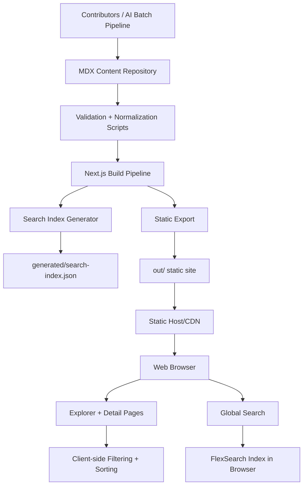

# FreeTierWiki Architecture

## 1) High-Level System Overview

FreeTierWiki is a statically exported Next.js application backed by a structured MDX content repository. It enables developers to discover and evaluate ~800 free-tier services, APIs, tools, and learning resources through search, filtering, and decision guidance.

The platform is optimized for:

- Fast read performance (static delivery)
- Low operational overhead (no mandatory runtime backend)
- High content throughput (batch ingestion + schema validation)
- Strong discoverability (global search + multi-dimensional explorer filters)

At build time, the system:

1. Loads content from `content/services`, `content/tools`, and `content/resources`
2. Parses and validates frontmatter schema
3. Normalizes and enriches fields (domain, audience, risk metadata)
4. Generates static routes and registry aggregates
5. Produces a client search index
6. Exports static assets to `out/`

---

## 2) Architecture Diagram



---

## 3) Frontend Architecture

### 3.1 Framework and Rendering

- **Framework:** Next.js (App Router)
- **Language:** TypeScript (strict mode)
- **Rendering mode:** Static export (`output: "export"`)
- **Styling:** Tailwind CSS + shadcn/ui component system
- **Content rendering:** `next-mdx-remote` (RSC-compatible MDX rendering)

### 3.2 Routing Model

- `/` — Home page (featured items, low-risk picks, category/provider summaries)
- `/explorer` — Universal explorer table with search/filter/sort
- `/:kind/:slug` (implemented as `/[kind]/[...slug]`) — Detail pages
  - `kind ∈ {services, tools, resources}`

### 3.3 UI Composition

- **App shell**: persistent header, sidebar (desktop), footer
- **Header**: global search, theme toggle, mobile navigation drawer
- **Sidebar**: quick links by type, category, provider, tags
- **Explorer**: table-based multi-filter comparison UX
- **Content page**: decision guidance + metadata + free-tier details + MDX body

### 3.4 State Management

- **Store library:** Zustand
- **Scope:** Explorer filter/sort/query state
- **Initialization:** URL query params hydrate initial explorer state
- **Goal:** Shareable deep links and predictable filter behavior

---

## 4) Backend Architecture (Current + Target)

## 4.1 Current Runtime Architecture

FreeTierWiki currently runs as a **static-first architecture** with no required runtime API for end users.

Key backend responsibilities occur during build:

- Filesystem content loading
- Schema validation
- Data normalization
- Search index generation
- Static path generation

## 4.2 Target Runtime Architecture (Recommended Evolution)

For dynamic updates, personalized ranking, and external API access, introduce:

- **API Layer:** REST/GraphQL endpoints
- **Service Layer:** search, ranking, ingestion, moderation
- **Data Layer:** relational/document DB + cache + search engine

Suggested service boundaries:

- `ContentService` (CRUD + versioning)
- `SearchService` (query, ranking, facets)
- `IngestionService` (batch import, validation, enrichment)
- `AnalyticsService` (usage telemetry, trend signals)

---

## 5) Database Design

## 5.1 Current Data Model (File-Backed)

Each MDX file includes structured frontmatter conforming to `AtlasEntry` semantics.

Core entities:

- **Entry** (`services | tools | resources`)
- **Provider** (string-normalized)
- **Domain** (controlled vocabulary)
- **Tags/Subtypes/Audiences** (facets)

## 5.2 Recommended Relational Schema (Future)

```sql
-- Core catalog table
CREATE TABLE entries (
  id UUID PRIMARY KEY,
  kind TEXT NOT NULL CHECK (kind IN ('services','tools','resources')),
  slug TEXT NOT NULL,
  title TEXT NOT NULL,
  description TEXT NOT NULL,
  provider TEXT NOT NULL,
  domain TEXT NOT NULL,
  pricing_model TEXT NOT NULL,
  difficulty TEXT NOT NULL,
  production_readiness TEXT NOT NULL,
  when_to_use TEXT NOT NULL,
  when_not_to_use TEXT NOT NULL,
  free_tier_summary TEXT NOT NULL,
  free_tier_type TEXT,
  overage_risk TEXT,
  requires_card BOOLEAN DEFAULT false,
  popularity_score INT NOT NULL,
  usefulness_score INT NOT NULL,
  official_url TEXT,
  docs_url TEXT,
  featured BOOLEAN DEFAULT false,
  last_updated DATE NOT NULL,
  created_at TIMESTAMPTZ NOT NULL DEFAULT NOW(),
  updated_at TIMESTAMPTZ NOT NULL DEFAULT NOW(),
  UNIQUE(kind, slug)
);

CREATE TABLE entry_tags (
  entry_id UUID REFERENCES entries(id) ON DELETE CASCADE,
  tag TEXT NOT NULL,
  PRIMARY KEY(entry_id, tag)
);

CREATE TABLE entry_use_cases (
  entry_id UUID REFERENCES entries(id) ON DELETE CASCADE,
  use_case TEXT NOT NULL,
  PRIMARY KEY(entry_id, use_case)
);
```

## 5.3 Indexing Strategy

- `UNIQUE(kind, slug)` for route resolution
- B-tree indexes on: `provider`, `domain`, `kind`, `production_readiness`, `overage_risk`
- GIN full-text index over `title + description + tags + use_cases + best_for`
- Optional trigram index for typo tolerance

---

## 6) Data Flow

## 6.1 Build-Time Flow

1. Contributor/AI pipeline produces MDX files
2. Validation scripts enforce schema and consistency
3. Build pipeline loads entries and computes registries
4. Search index JSON generated
5. Next.js static export generated
6. Assets deployed to CDN/static hosting

## 6.2 Runtime Flow (User Request)

1. User opens `FreeTier.wiki`
2. Static page delivered via CDN
3. Browser hydrates interactive explorer UI
4. User searches/filters locally against preloaded metadata/search index
5. User navigates to detail page with full decision context

---

## 7) Search and Filtering Architecture

## 7.1 Search

- **Engine:** FlexSearch Document index in browser
- **Indexed fields:** title, tags, description, content, domain, bestFor
- **Result handling:** top-N retrieval with de-duplication by entry id
- **UX:** instant suggestions in header + query handoff to explorer

## 7.2 Filtering and Sorting

Explorer supports multi-dimensional filters:

- Provider
- Content kind
- Domain/category
- Tag (single and multi-select combinations)
- Free-tier type
- Overage risk
- Production readiness
- Difficulty
- Requires-card

Sort modes prioritize different decision intents:

- Best overall
- Lowest billing risk
- Easiest to start
- No-card first
- Production-light suitability

---

## 8) Scalability Considerations

### 8.1 Current Capacity Envelope

Static architecture scales well for read-heavy workloads:

- CDN edge caching handles global traffic
- No backend compute bottleneck for public browsing
- Search/filter execute client-side

### 8.2 Growth Risks

As entry count grows (>5k):

- Search index payload size may increase initial load time
- Client-side filtering over very large arrays may impact low-end devices
- Build times increase with content volume and validations

### 8.3 Mitigations

- Split search index into chunks by kind/domain
- Lazy-load non-critical registries
- Use worker threads/web workers for large query workloads
- Add incremental build strategy (content-diff-aware indexing)

---

## 9) Caching Strategy

## 9.1 CDN Caching

- Cache static HTML/JS/CSS/assets aggressively with immutable fingerprinting
- Use stale-while-revalidate for search index JSON where applicable

## 9.2 Browser Caching

- Cache search index and static assets via standard cache headers
- Optional Service Worker for offline-friendly read experience

## 9.3 Build Cache

- Reuse Node dependency cache in CI
- Cache generated artifacts where deterministic

---

## 10) Deployment Architecture

## 10.1 Hosting

- Static export output deployed to:
  - Cloudflare Pages (primary recommendation)
  - GitHub Pages (supported)

## 10.2 CI/CD Pipeline

Typical flow:

1. Trigger on push/PR
2. Install dependencies
3. Validate content
4. Generate search index
5. Build static export
6. Upload/deploy static artifacts

## 10.3 Environment Configuration

- `NEXT_PUBLIC_BASE_PATH` for sub-path hosting scenarios
- Build output directory: `out`

---

## 11) Security and Governance

- No user-generated runtime writes in current architecture
- Content changes occur via reviewed commits/PRs
- Source URL traceability reduces unverifiable claims
- Future API mode should include rate limiting, auth scopes, audit logs

---

## 12) Architectural Assumptions

- Primary product experience remains publicly readable without login
- Content quality is enforced by schema + lint scripts
- Build-time generation remains acceptable for update frequency
- Runtime DB/API is a future enhancement, not a current requirement